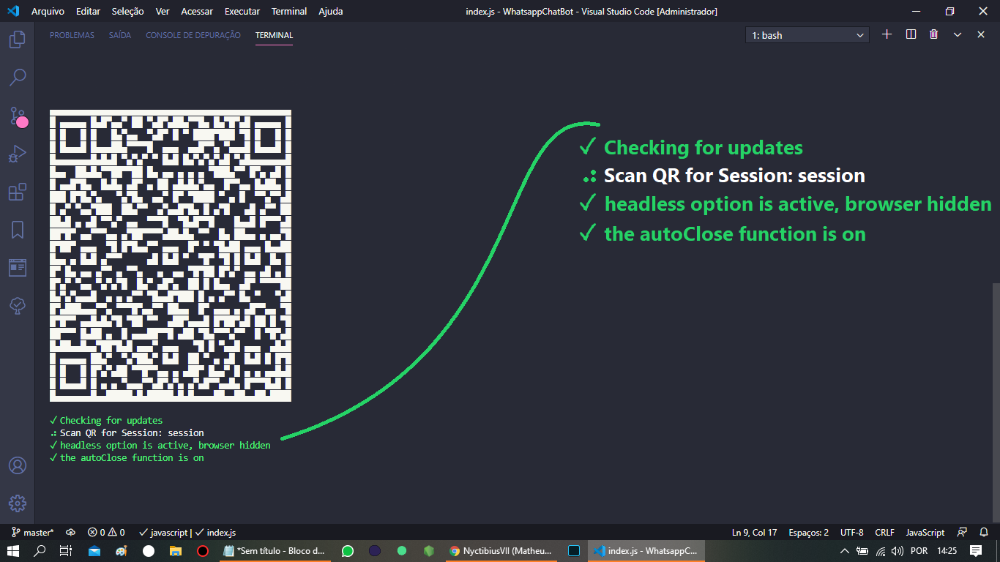

<h1 align="center">
  <br>
    
</h1>
<!-- <h4 align="center">Contexto...</h4> -->
<p align="center">
  
  
  
  <a href="https://github.com/NyctibiusVII/WhatsappChatBot/blob/master/LICENSE">
    
  </a>
  <a href="https://picpay.me/Matheus_nyctibius_vii">
  
  </a>
</p>
<p align="center">
  <a href="#WhatsappChatBot-">Projeto</a>&nbsp;&nbsp;&nbsp;|&nbsp;&nbsp;&nbsp;
  <a href="#Tecnologia-">Tecnologia</a>&nbsp;&nbsp;&nbsp;|&nbsp;&nbsp;&nbsp;
  <a href="#Layout-">Layout</a>&nbsp;&nbsp;&nbsp;|&nbsp;&nbsp;&nbsp;
  <a href="#Licença-%EF%B8%8F">Licença</a>
</p>
<p align="center">
    <a href="README.md">Inglês</a>
    ·
    <a href="README-pt.md">Português</a>
</p>

# WhatsappChatBot 
BOT para Whatsapp usando NodeJS e a dependência Venom bot.

Não se trata apenas de um ChatBot de resposta rápida, este robô (bot) desempenha o papel de um atendente / ajudante na escolha dos seus tipos de roupa, desde a sua apresentação ao fechamento do pedido, captando o que o cliente pretende e apresentando o site com a pesquisa dos itens escolhidos.

#### Funcionalidades
* Envio e recebimento de mensagens - (WhatsApp)
* Verificação dos dados recebidos
* Conecte ao Whatsapp via código QR
* Pré-atendimento para uma loja online de roupas

## Tecnologia 🚀
Este projeto foi desenvolvido com as seguintes tecnologias:

- [Nodemon | ^2.0.5](https://nodejs.org/en/)
- [Venom Bot | ^2.0.18](https://github.com/orkestral/venom) 🕷

## Layout 🚧
#### Desktop Screenshot - (DEV)
<div style="display: flex; flex-direction: 'column'; align-items: 'center';">
<!-- 35,56 cm | 14” in, Laptop print (Lenovo ideapad 310-14ISK) -->
   
   
</div>

#### Mobile Screenshot - (USER)=> {trabalho_em_progresso}
<div style="display: flex; flex-direction: 'row';">
<!-- 154.4 x 72.2, Mobile print (Motorola G6 Play) -->
   
   
   
   
   
</div>

#### Vídeo - (.gif)=> {trabalho_em_progresso}
<div style="display: flex; flex-direction: 'column'; align-items: 'center';">
   
</div>

## Próximos passos
**A FAZER |**`Verificar o profile, se tiver diferente ele seta para ${NAME}`<br>
**A FAZER |**`Erro das logoTexts (undefined) no log >bash`<br>
**FEITO |**`Qual type de audio? (TypeSyntax)`<br>
**FEITO |**`Qual type de imagem? (TypeSyntax)`<br>
**A FAZER |**`Parar quando usuário não adicionar NADA`<br>
**----------** `Verificação no 1° - '#'`<br>
**A FAZER |**`Quando add pelo menos 1 item, mostrar opção para deletar itens`<br>
**A FAZER |**`Diminuir a confirmação de dados`<br>
**A FAZER |**`Inverter a estrutura das mensagens iniciais`<br>
**A FAZER |**`Juntar as mensagens de agradecimento para o usuário não ter que digitar mais uma vez para aparecer a resposta`<br>

## Rodando o projeto 🚴🏻‍♂️

```bash
# Clone o repositório
$ git clone https://github.com/NyctibiusVII/WhatsappChatBot.git

# Acesse a pasta do projeto no prompt de comando
$ cd WhatsappChatBot

# Use os padrões
$ npm init -y

# Limpar cache - (prevenção de erro de instalação)
$ npm cache verify

# Instale as dependências
$ npm i --save-dev
...
$ npm i venom-bot

# Execute o script "dev"
$ npm run dev

" Aponte a câmera do seu celular e leia o código QR gerado com 'WhatsApp Web'"
```

#### ⚠ AVISO ⚠
`A aplicação é toda feita para a `**lingua portuguêsa (pt-br)**`, ou seja, se fizer um clone esteja atento a mudar alguns textos para a sua lingua.`

## Contribuição 💭
Solicitações pull são bem vindas. Para mudanças importantes, abra um issue primeiro para discutir o que você gostaria de mudar.

## Licença ⚖️
Este projeto está sob a licença do MIT. Veja o arquivo [LICENSE](https://github.com/NyctibiusVII/WhatsappChatBot/blob/master/LICENSE) para mais detalhes.

## Contato ✉️
| <br><sub><a href="https://www.instagram.com/nyctibius_vii/?hl=pt-br">@MatheusVidigal🦊</a></sub> |
| :---: |

<p align="left">
   <a href="https://www.linkedin.com/in/matheus-vidigal-nyctibiusvii/">
      
   </a>
   <a href="https://mail.google.com/mail/u/1/#inbox?compose=GTvVlcSGLCKpKJfwPsKKqzXBplKkGtCLvCQcFWdWxCxQFfkHzzjVkgzrMFPBgKBmWFHvrjrCsMqSH">
      
   </a>
</p>
<!--
Cor - WhatsApp:
#075e54;
#128c7e;Sombra: #147E71;
#25d366;Sombra: #2DB961;
#dcf8c6;
#34b7f1;
#ece5dd;
-->