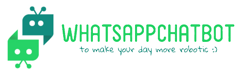
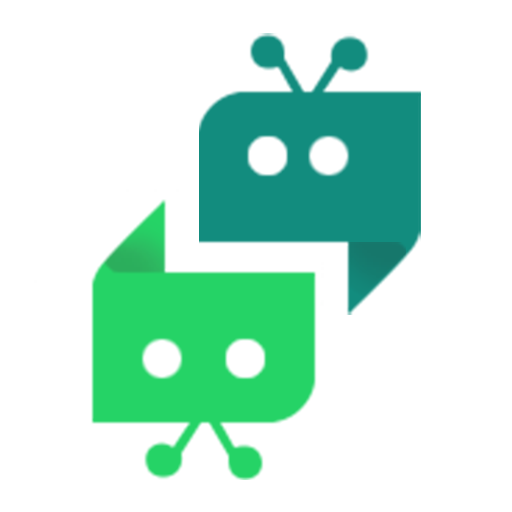
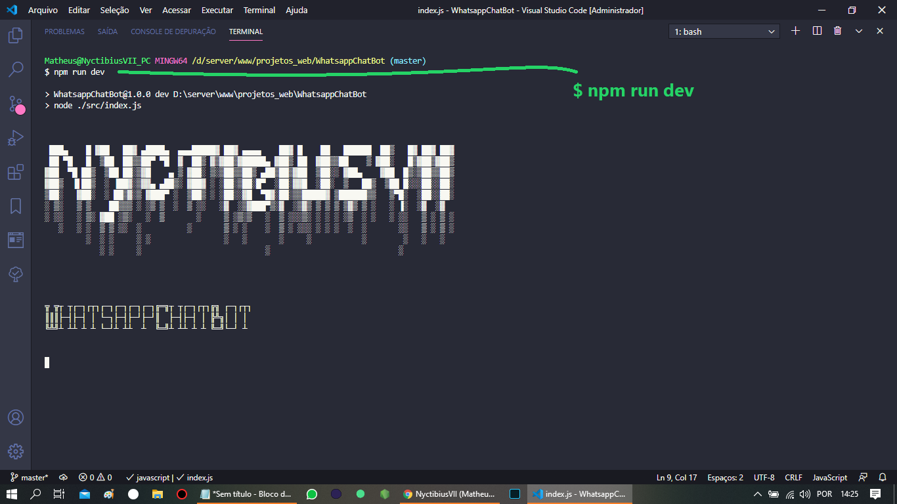
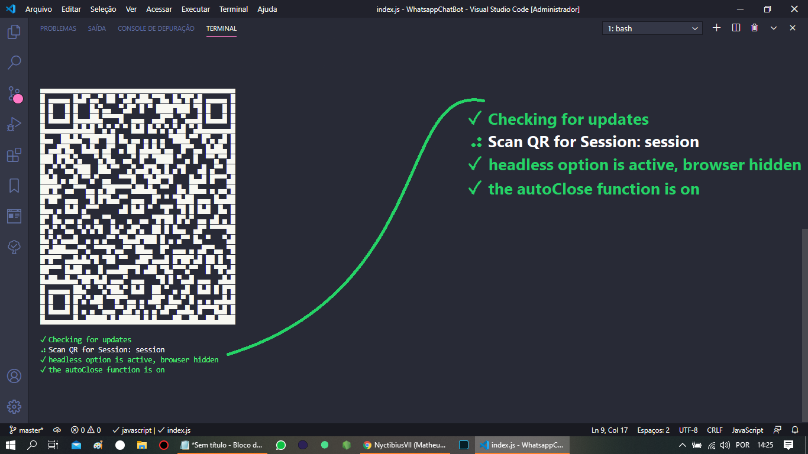
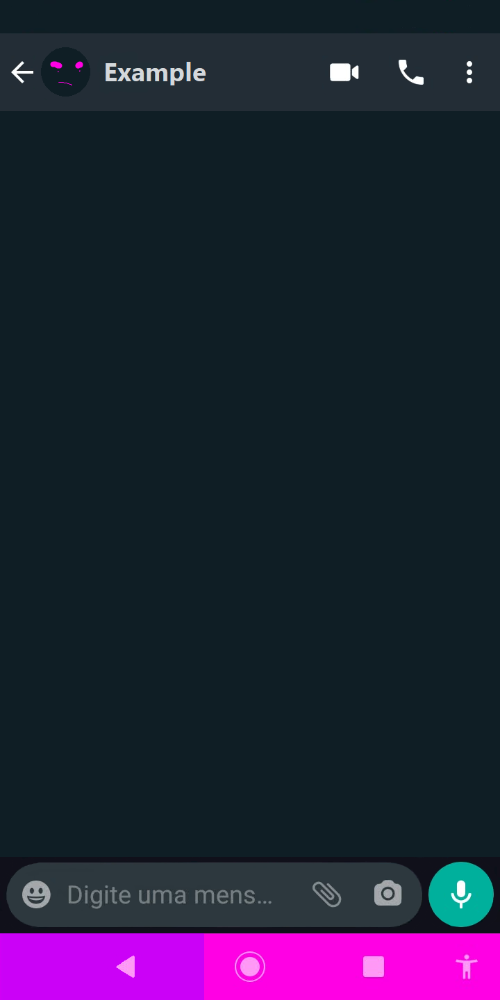

<h1 align="center">
  <br>
    
</h1>
<!-- <h4 align="center">Context...</h4> -->
<p align="center">
  
  
  
  <a href="https://github.com/NyctibiusVII/WhatsappChatBot/blob/master/LICENSE">
    
  </a>
  <a href="https://picpay.me/Matheus_nyctibius_vii">
  
  </a>
</p>
<p align="center">
  <a href="#WhatsappChatBot-">Project</a>&nbsp;&nbsp;&nbsp;|&nbsp;&nbsp;&nbsp;
  <a href="#technology-">Technology</a>&nbsp;&nbsp;&nbsp;|&nbsp;&nbsp;&nbsp;
  <a href="#layout-">Layout</a>&nbsp;&nbsp;&nbsp;|&nbsp;&nbsp;&nbsp;
  <a href="#license-%EF%B8%8F">License</a>
</p>
<p align="center">
    <a href="README.md">English</a>
    ·
    <a href="README-pt.md">Portuguese</a>
</p>

# WhatsappChatBot 
BOT for Whatsapp using NodeJS and the Venom bot dependency.

It is not just a quick response chat bot, this robot (bot) plays the role of an attendant / helper in choosing their types of clothes, from their presentation to the closing of the order, capturing what the customer wants and showing the website with the item search.

#### Functionalities
* Sending and receiving messages - (WhatsApp)
* Verification of received data
* Connect you to Whatsapp via QR code
* Pre-service for an online clothing store

## Technology 🚀
This project was developed with the following technologies:

- [Nodemon | ^2.0.5](https://nodejs.org/en/)
- [Venom Bot | ^2.0.18](https://github.com/orkestral/venom) 🕷

## Layout 🚧
#### Desktop Screenshot - (DEV)
<div style="display: flex; flex-direction: 'column'; align-items: 'center';">
<!-- 35,56 cm | 14” in, Laptop print (Lenovo ideapad 310-14ISK) -->
   
   
</div>

#### Mobile Screenshot - (USER)=> {working_in_progress}
<div style="display: flex; flex-direction: 'row';">
<!-- 154.4 x 72.2, Mobile print (Motorola G6 Play) -->
   
   
   
   
   
</div>

#### Video - (.gif)=> {working_in_progress}
<div style="display: flex; flex-direction: 'column'; align-items: 'center';">
   
</div>

## Next steps
**DO |** `Check the profile, if different it sets ${NAME}`<br>
**DO |** `LogoTexts error (undefined) in log >bash` <br>
**DONE |** `What type of audio? (TypeSyntax)`<br>
**DONE |** `Which type of image? (TypeSyntax)`<br>
**DO |** `Stop when user does not add ANYTHING`<br>
**----------** `Verification in the 1st - '#'`<br>
**DO |** `When add at least 1 item, show option to delete items`<br>
**DO |** `Decrease data confirmation`<br>
**DO |** `Reverse the structure of the initial messages`<br>
**DO |** `Join the thank you messages so that the user does not have to type again to get the answer`<br>

## Running the project 🚴🏻‍♂️

```bash
# Clone the repository
$ git clone https://github.com/NyctibiusVII/WhatsappChatBot.git

# Access the project folder at the command prompt
$ cd WhatsappChatBot

# Use the defaults
$ npm init -y

# Clear cache - (installation error prevention)
$ npm cache verify

# Install the dependencies
$ npm i --save-dev
...
$ npm i venom-bot

# Run the script "dev"
$ npm run dev

" Point your phone's camera and read the QR code generated with 'WhatsApp Web'"
```

#### ⚠ DISCLAIMER ⚠
`The application is all made for the `**Portuguese language (pt-br)**`, in other words, if you make a clone be careful to change some texts to your language.`

## Contribution 💭
Pull requests are welcome. For major changes, please open an issue first to
discuss what you would like to change.

## License ⚖️
This project is under the MIT license. See the archive [LICENSE](https://github.com/NyctibiusVII/WhatsappChatBot/blob/master/LICENSE) for more details.

## Contact ✉️
| <br><sub><a href="https://www.instagram.com/nyctibius_vii/?hl=pt-br">@MatheusVidigal🦊</a></sub> |
| :---: |

<p align="left">
   <a href="https://www.linkedin.com/in/matheus-vidigal-nyctibiusvii/">
      
   </a>
   <a href="https://mail.google.com/mail/u/1/#inbox?compose=GTvVlcSGLCKpKJfwPsKKqzXBplKkGtCLvCQcFWdWxCxQFfkHzzjVkgzrMFPBgKBmWFHvrjrCsMqSH">
      
   </a>
</p>
<!--
Color - WhatsApp:
#075e54;
#128c7e;Shadow: #147E71;
#25d366;Shadow: #2DB961;
#dcf8c6;
#34b7f1;
#ece5dd;
-->